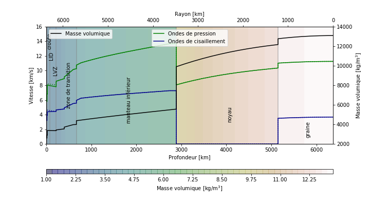

# PREM (Dziewonski & Anderson 1981)
 
Implementation of the PREM profiles in python functions.

Implémentation des fonctions de densités/vitesses sismiques de PREM. 

Based on/Basé sur Dziewonski, A. M., & Anderson, D. L. (1981). Preliminary reference Earth model. Physics of the earth and planetary interiors, 25(4), 297-356.

The notebook provides a few methods to get pretty figures with PREM density profile. 

Le notebook donne quelques méthodes pour avoir une jolie figure avec le profil de densité de PREM. 

(Figures are in French)

